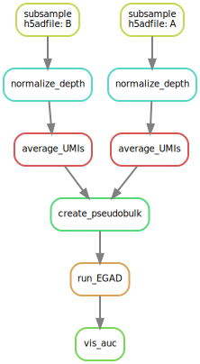

# BIOF501 Term Project: Pipeline for Pseudobulking and Function Prediction 

### *By Alex Adrian-Hamazaki*

--------------------

## Repository Contents

### Directories

 + bin: contains scripts used for creating pseudobulk and function prediction
 
### Files
 
 + environment.yml: Contains dependencies for workflow. Used to build conda environment.
 
 + Snakefile: Instructions for snakemake to run pipeline.

 + config.yaml: Config file containing global parameters specific to your .h5ad file.
 
 + dag.svg: Representation of overall workflow of the pipeline.
 
 + README.md: File containing information about how to run the pipeline.


## Introduction


### Purpose

This pipeline takes scRNAseq data in the form of .h5ad files, creates pseudobulk, and then performs function prediction.

### Background and Rationale

Although scRNAseq has been a momentous technique for genetics, how its expression reads differ from bulkRNA seq has not been fully explored. For example, because bulk is made of single cells, we might expect that we could sum up scRNAseq data to generate bulkRNAseq data that is identical to the bulkRNAseq data we would have generated if we just performed bulkRNAseq in the first place. Unfortunately, as with most problems in biology, the connection between scRNAseq data and bulkRNAseq data is not that simple. Instead, it is highly complex and confounded by many technical challenges. My master’s thesis surrounds investigating differences between scRNAseq, and bulkRNAseq data as it pertains to gene function prediction.

There are many models that use bulkRNAseq to predict functions of genes. Although many of these programs use deep learning techniques, simpler machine learning techniques that are interpretable have been shown to perform equally well. The function prediction model that I am using in my thesis is called the “Extending guilt by association by degree” (EGAD) model. EGAD applies a K-nearest-neighbor (K-nn) approach to attempt to predict GO annotations. This is treated as a binary classification problem, where genes either do, do not contain a given GO annotation. EGAD does this by leveraging the co-expression of genes. The co-expression between two genes is a spearman correlation between two genes. EGAD treats genes as nodes, and co-expression as edges. Upon hiding GO annotations for a quarter of genes, it applies the K-nn algorythm to predict if a given genes have  given GO-annotations. This process is then iterated on the next quarter of genes. The success of EGAD is measured via AUC for each GO annotation.

Currently, there is no way to perform function prediction using scRNAseq data. Thus, the only way to investigate function prediction between bulk and scRNAseq is to create  “pseudobulk” from the scRNAseq data. To create pseudobulk data, single cell data is grouped by biological context, such as “cell type” or “organism part”. Expression is then averaged within each group. As an end result, an expression matrix is created, where rows are different biological contexts, columns are genes, and values in the matrix represent the average expression of a gene in a biological context. 

### Workflow Overview

The key steps of this workflow are listed here:

1. Subsample scRNAseq Data (for the purpose of reducing run time for this project)
2. Normalize scRNAseq Data for UMI depth
3. Get the Average UMI Counts of each Cell Type
4. Create Pseudobulk by aggragating the Average UMI Counts
5. Perform EGAD for function preduction
6. Visualize distrubution of AUCs

 

--------------------

## Usage

### Dependancies

```
python=>3.9.13
snakemake=>7.18.1
```

### Installation

Installing this pipeline requires [conda](https://conda.io/projects/conda/en/stable/user-guide/install/download.html), [git](https://git-scm.com/book/en/v2/Getting-Started-Installing-Git), and [snakemake](https://snakemake.readthedocs.io/en/stable/getting_started/installation.html).


First, clone the repository by running the following command in a terminal:

```
git clone https://github.com/AlexAdrian-Hamazaki/Pseudobulk_Function_Pipeline
```

Next, use the provided `environment.yml` file to build the conda environment:
```
conda env create --file environment.yml
```

### Preparing `.h5ad` files

Because scRNA-seq files can be extroadinarily large, they are often kept in an annotated sparse matrix format called `.h5ad`.
This pipeline requires `.h5ad` files to as an input

First, create a directory to hold your `.h5ad` files running the following in a terminal:

```
mkdir data/h5ad
```

Next, move the `.h5ad` files you want to run through the pipeline into `data/h5ad`

As an example, try the `TS_Liver.h5ad` and `TS_Skin.h5ad` datasets from Tabula Sapiens as found [here](https://figshare.com/articles/dataset/Tabula_Sapiens_release_1_0/14267219)

```
mv {somedirectory/h5adfile} data/h5ad
```
### Changing Global Parameters

Global Parameters must be changed to align with your `.h5ad` files

1) Open config.yaml
2) Change `UserInput_CellTypeColumn`: This global paramater corresponds to the column in your `.h5ad` file's anndata.obs path that contains the cell type                                         meta-data that you will pseudobulk using. Eg: If you want have cell type information in a column called                                                     adata.obs['cell_type'], change this parameter to 'cell_type'. Input must be string.

Once Global Parameters are set, you are ready to use the pipeline!

### Running The Pipeline

Because the pipeline can take a long time depending on how many cells you have measured, and how many genes you have data for, I reccomend using a tmux shell to run the pipeline. For more informaton on tmux click [here](https://linuxize.com/post/getting-started-with-tmux/)

Using Tmux (Optional)
```
tmux new -s pipeline
tmux attach-session -t pipeline
```

Before running the pipeline you need to activate the conda environment you created

```
conda activate environment
```

To run the pipeline, simply enter:

```
snakemake --cores 4
```
You can choose to change the amount of cores you use by changing "4" to the desired number


=======


## Relevant Output

### Files
 
 + data/pseudobulk/pseudobulk.csv: Pseudobulk generated from scRNAseq data

 + data/EAGD/EGAD.csv: EGAD output. Contains AUC values for each GO Annotation
 
 + data/figs/auc.jpeg: Histogram of AUC's generated by EGAD
